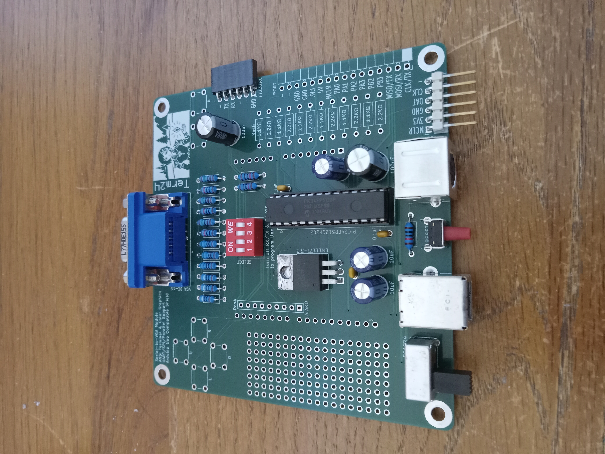
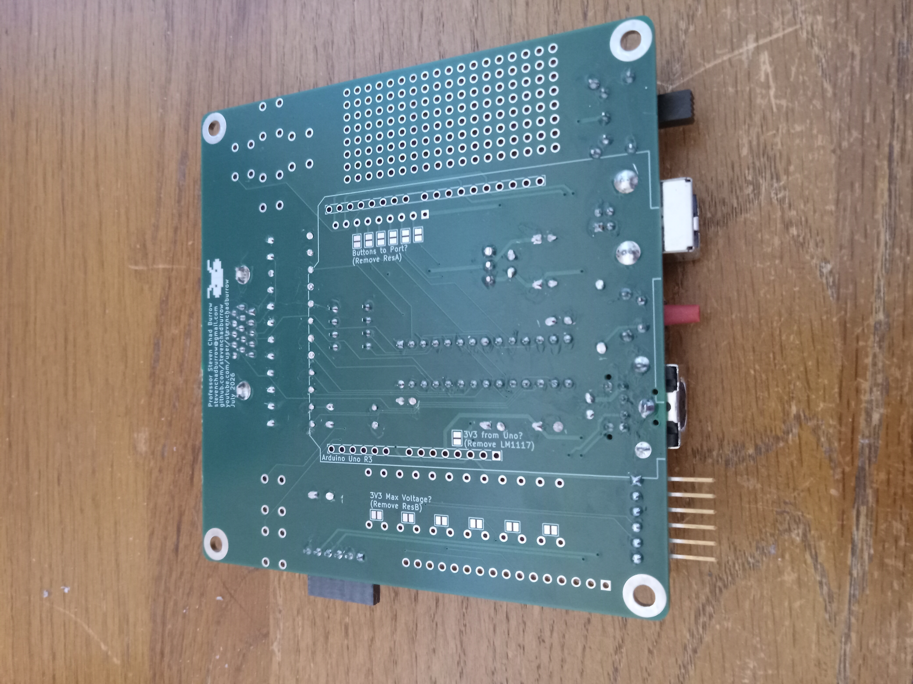
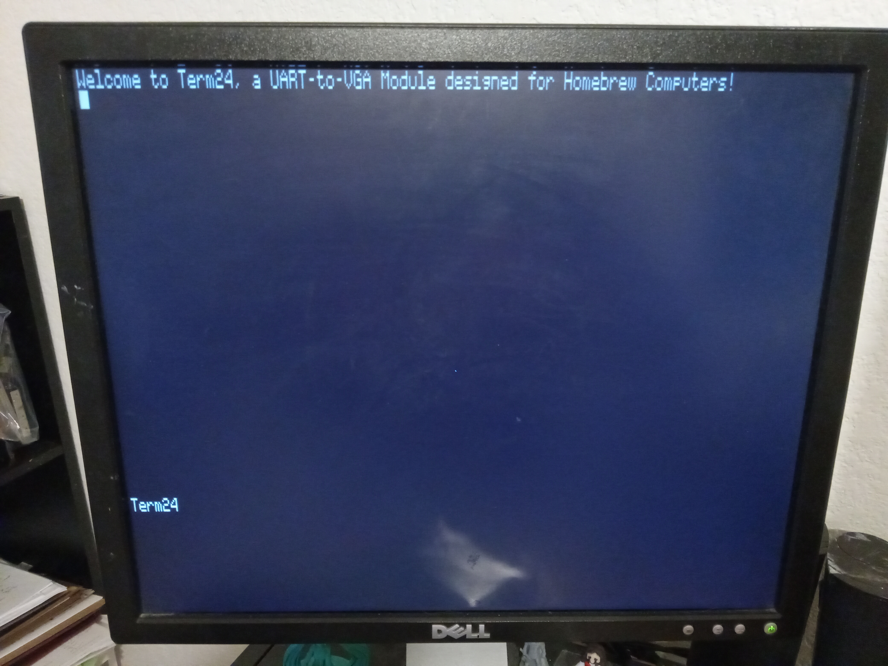
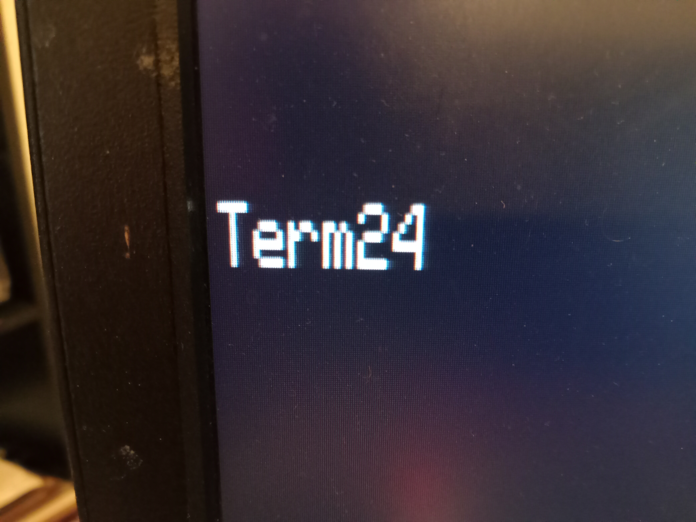
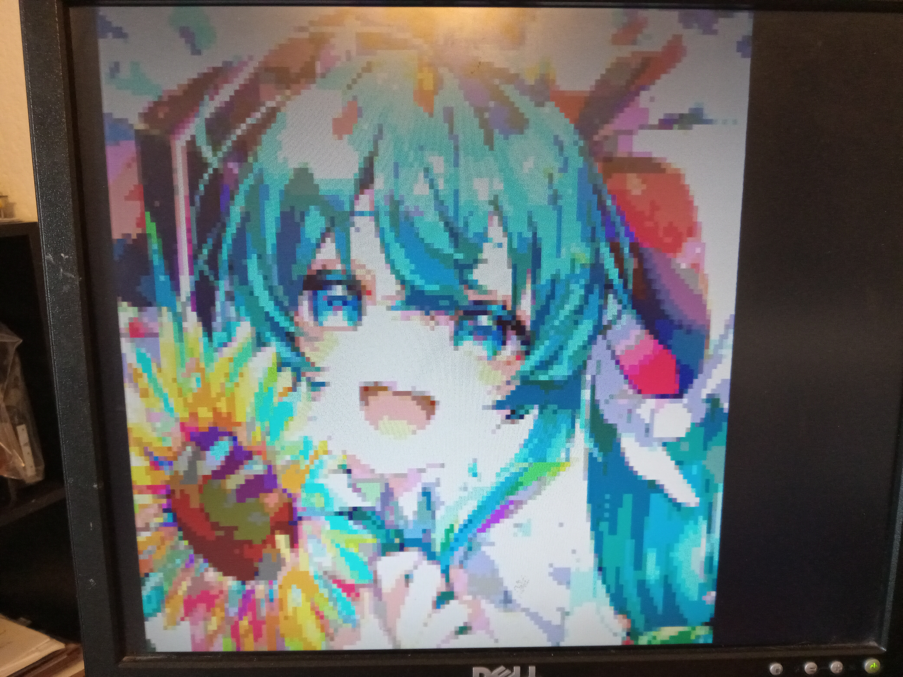
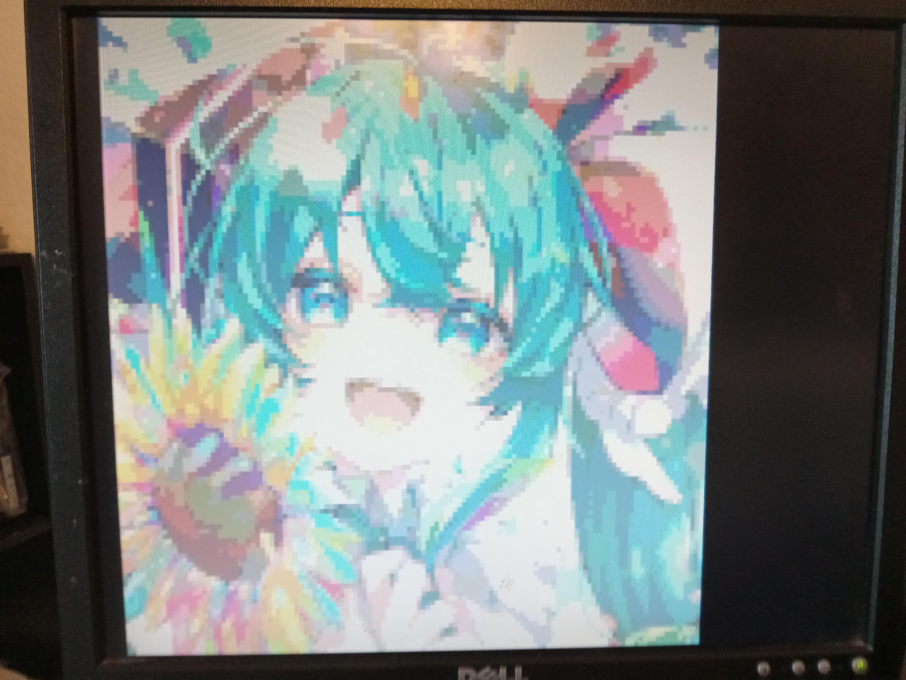
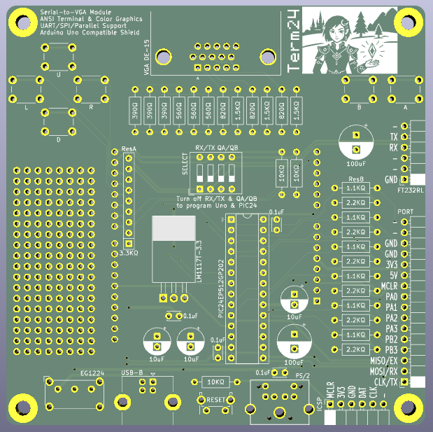
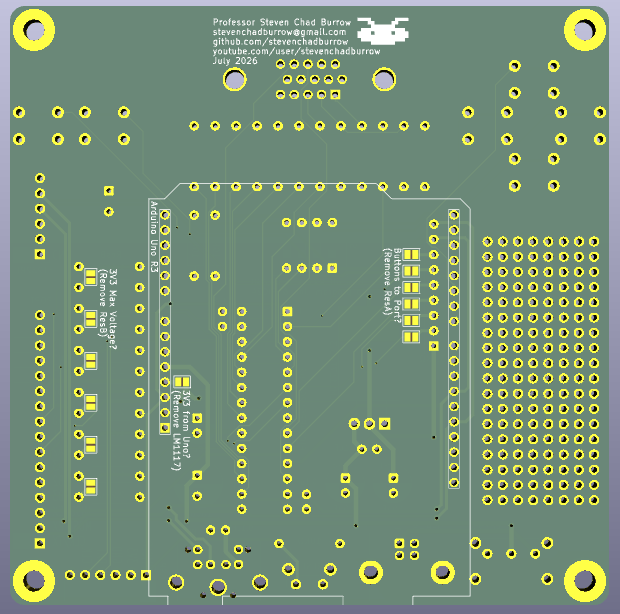

# Term24
VGA Terminal/Graphics Module using a PIC24 

This module is designed to output an 80x24 Terminal to a VGA display.  It accepts standard ANSI escape codes and includes customized escape codes for switching modes and changing internal memory.  It also has the capability of displaying 128x128 pixels at 128 colors, either double-buffered, layered, or with scrolling.  It has built in buttons to double as a gamepad. 

It can be accessed through four different protocols: UART, PS/2 Keyboard, SPI, or Parallel Input.  It can be used as a shield for the Arduino Uno, or it can be used with any homebrew computer and is easily plugged in to a breadboard. 

It uses the PIC24EP512GP202 microcontroller, running at 65 MIPS and containing 512KB of ROM and 48KB of RAM.  The only other IC on-board is the LM1117 voltage regulator.  All components are through-hole for ease of soldering. 

 
 
 
 
 
 
 
 
 
